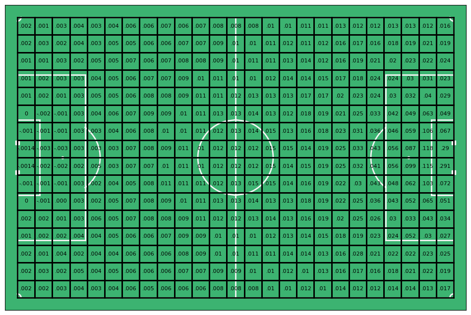
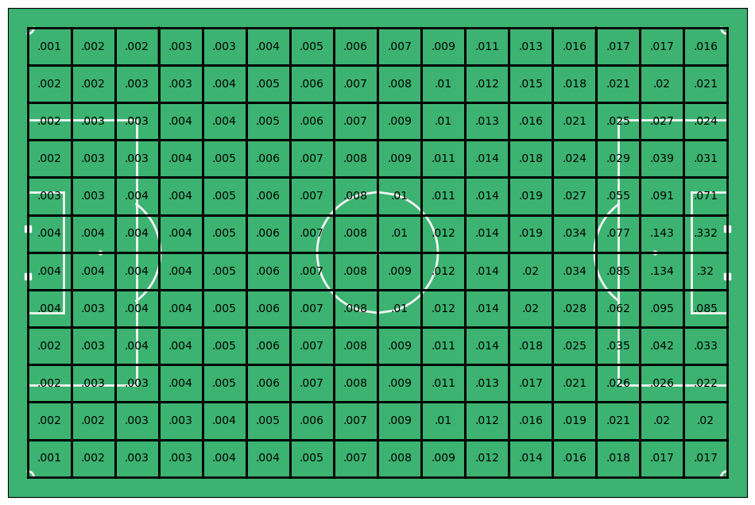

# Simple xG xT Generation

Generate xG and xT values to improve your football match analysis using a static xG and xT model.


## Getting Started
1. Clone the repository

   ```shell
   git clone https://github.com/JohnComonitski/xgxt.git
   ```

2. Copy the files `utils.py`, `xg.py` and `xt.py` into your project

3. Install the Numpy dependencies

   ```shell
   pip install numpy
   ```

 4. Import the libraries into your project

     ```python
     from xg import *
     from xt import *
     ```

  5. Use the `get_xg` and `get_xt` functions to generate xG and xT values

     ```python
     coords = (100, 50)
     print(get_xg(coords))
     print(get_xt(coords))
     ```
 
## xG and xT Values

This library generates simple xG and xT values for football analysts in need of a "quick and dirty" xG or xT model. It should be noted that this is a simple and static model. Professional models are far more dynamic and consider factors such as the opposition's location on the pitch and shot quality. This model does not. The goal of this library is to approximate the xG/xT model in cases where getting it 90% of the way there is sufficient.

**xG Plot**


**xT Plot**

